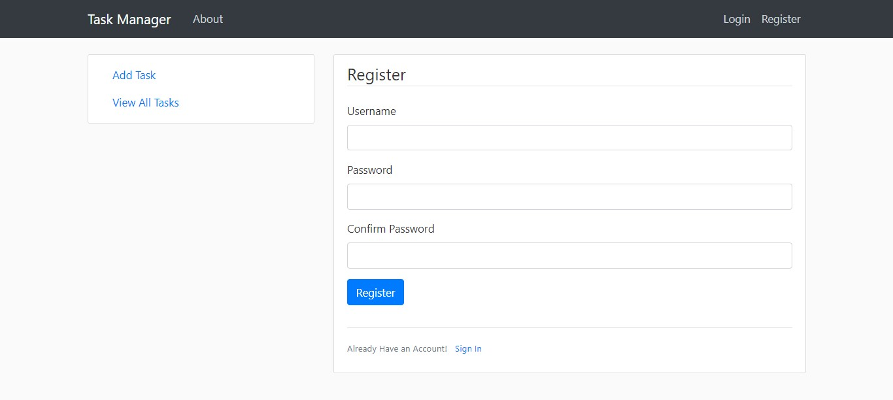
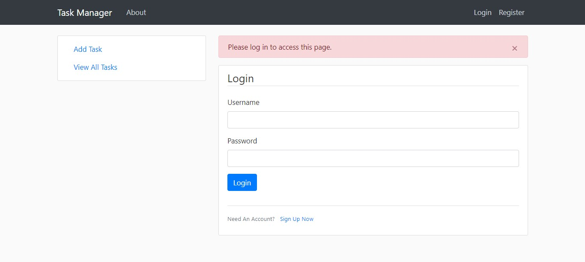
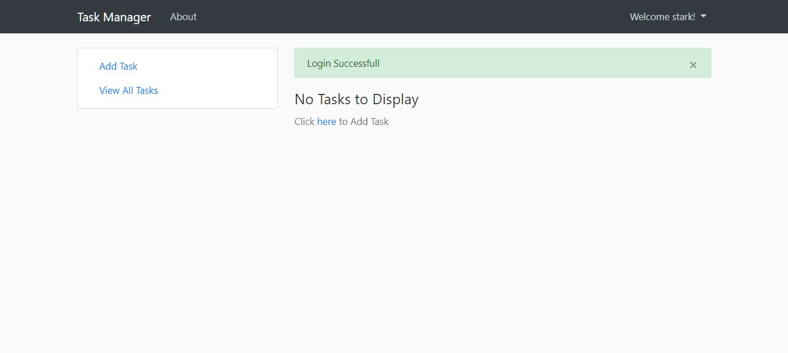
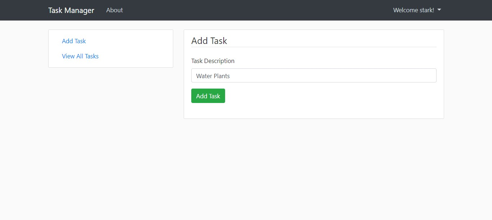
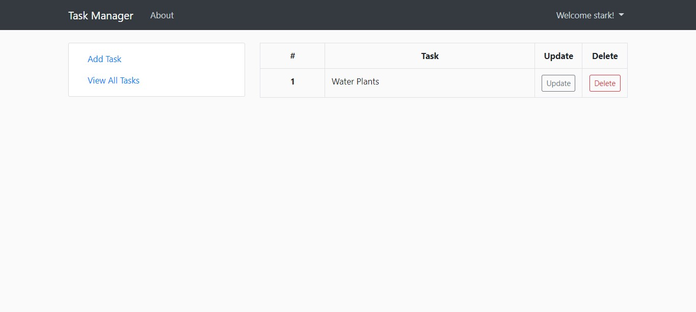
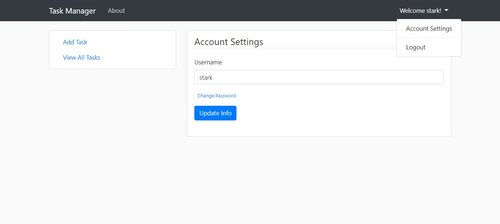

# Task-Manager-using-Flask

A simple web application to store your To-Do Tasks .

# Features

- User Authentication
- Easy to use and deploy locally.

# Requirements

Execute the following command to install the required third party libraries:

```pip3 install -r requirements.txt```

# Usage

1. Clone the repository using the following command
    
    ```git clone https://github.com/AdityaBagad/Task-Manager-using-Flask.git```

2. Install the dependencies using

    ```cd  Task-Manager-using-Flask```
    
    ```pip3 install -r requirements.txt```

3. Run this command to start the application

    ```cd todo_project```

    ```python run.py```

# Results

## Registration Page
Login or Register if you dont have an account



## Accessing URL's 
User cannot access any URL's if they are not logged in



## After Successfull Login
See all your tasks after successfull login.



## Add Tasks
Click the **Add Task** link in the side-bar to add tasks



## View All Tasks
Click the **View All Task** link in the side-bar to see all tasks. You can **Update** and **Delete** Tasks from this page.



## Account Settings
Change your username and password. You can access this by clicking dropdown in the Navbar



